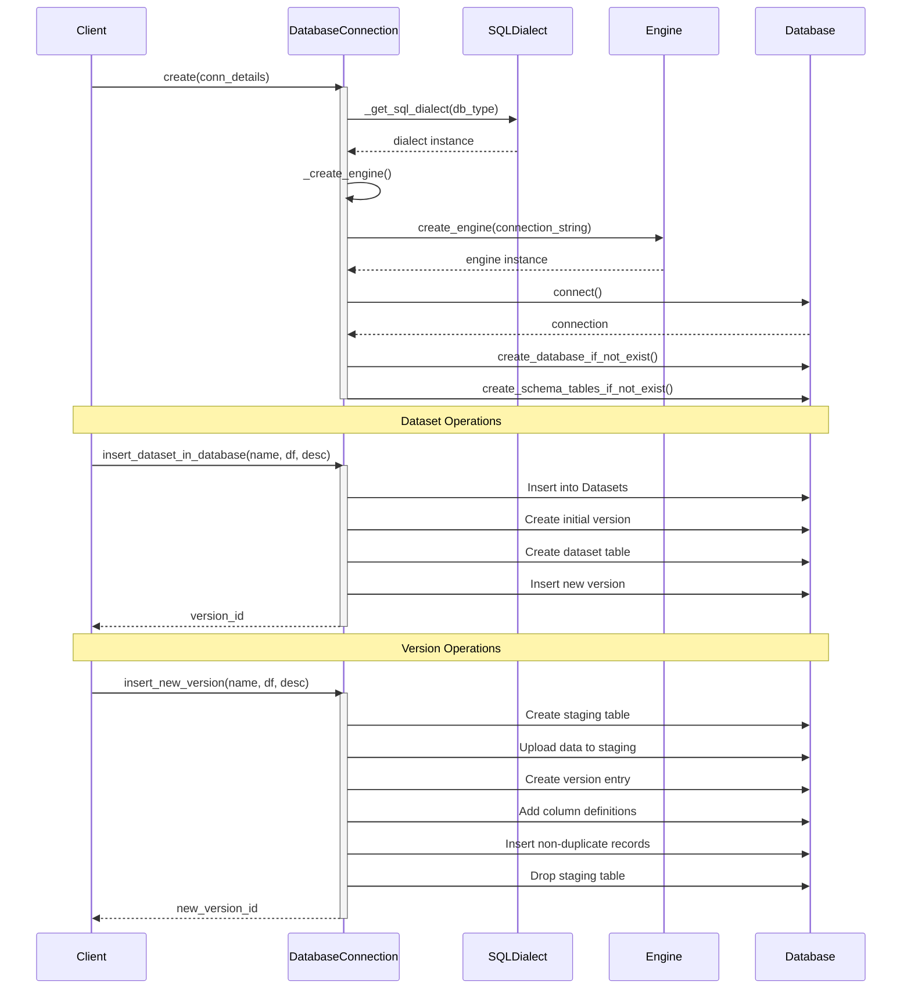
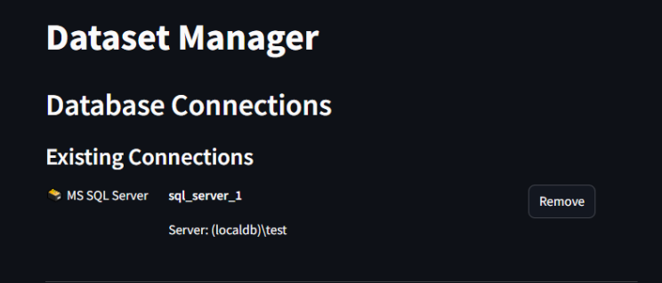
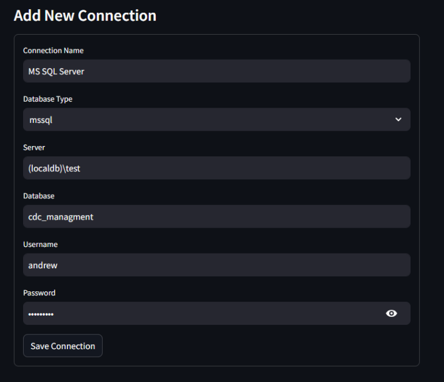
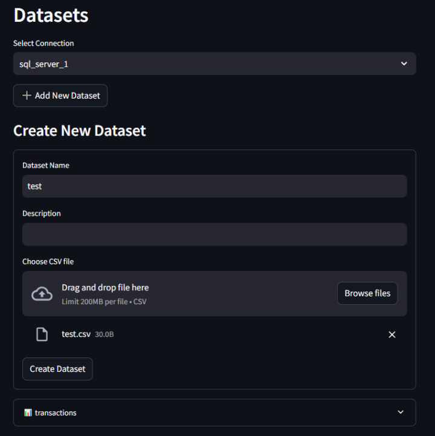
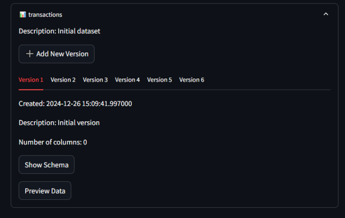
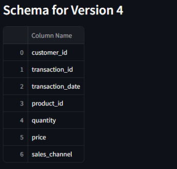
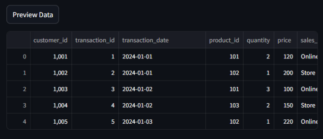

  <h1> Data Versioning Control System</h1>
  
  
  
  

  

  

  
  <h3>  Manage and Track Changes in Your Datasets with Ease!</h3>
  
  

## :star2: About The Project

Here's a breakdown of the key components:

-   **Database Connections**: Manage connections to multiple databases including MS SQL Server, MySQL, and PostgreSQL. Easily add, remove, and view connection details.
-   **Dataset Management**: Upload new datasets and create new versions with detailed descriptions. Track changes across multiple versions and visualize schema and data differences.
-   **Version Control**: Maintain a history of dataset versions with metadata including creation date, description, and column definitions. Ensure data integrity and traceability.
-   **Schema Evolution**: Automatically detect and handle schema changes such as new columns. Ensure backward compatibility and seamless data integration.
-   **Data Visualization**: Preview dataset versions and visualize schema changes directly within the application. Utilize Streamlit's interactive components for a user-friendly experience.

## 📈 Diagrams

Sequence Diagram:

Relational Schema:

## 🧰 Usage

- Example Screenshots:

## 👩‍💻 TODO

- Apply Tracking data type for column definition (add column in `column_definition` table and make the naming convention for the `d_name` table to be `columnName_type`)
- Add Multiple connection types through createing more dialects and supported connections (MYSQL, Postgres)
- Create Migration Script to migrate historical data between multiple databases/data warehouses
- Create partitioning strategy to paralyze upload of the staging table and download of needed data.
- Create a limit in the graphical view to limit the number of records that can show to the user (for performance)